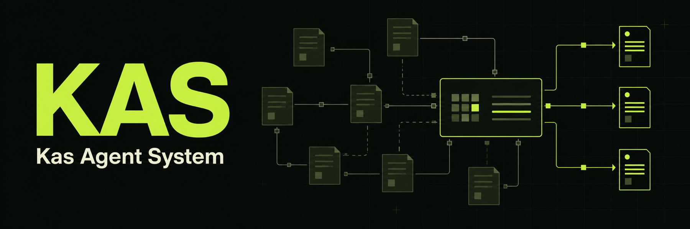
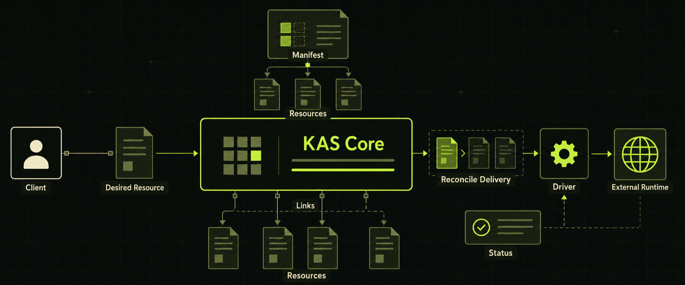
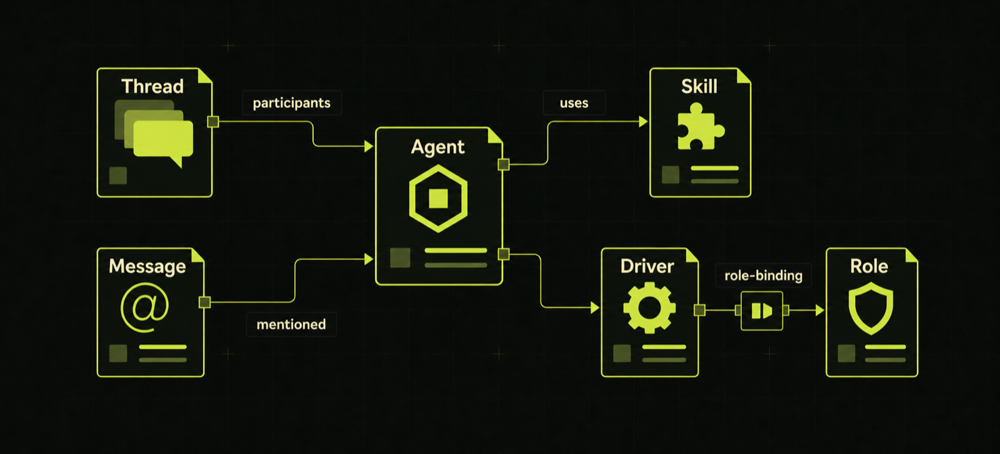
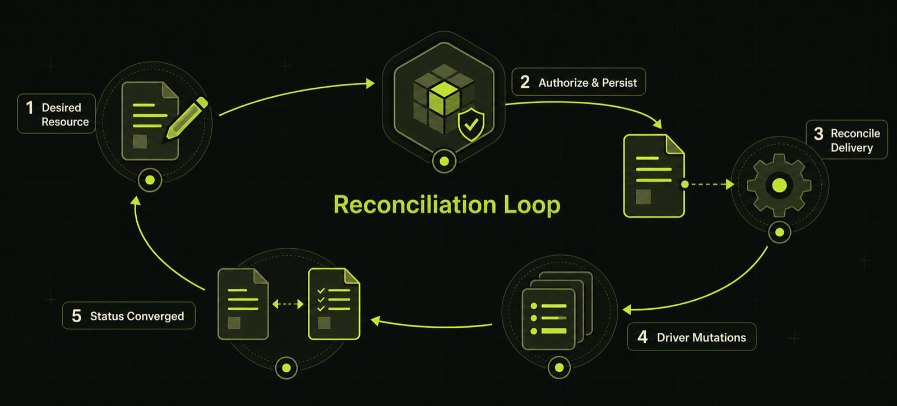

# KAS

English | [简体中文](README.zh-CN.md)



> One Resource model for domain objects, relationships, authorization, and
> background coordination.

KAS is a Resource-oriented application control plane. You describe what should
exist; KAS stores those objects, enforces permissions, records relationships,
and sends each relevant change to the Driver responsible for handling it.

It is a foundation for Agent platforms, automation control planes, integration
hubs, and other systems where multiple background capabilities collaborate
around shared objects. The `core` branch contains the generic kernel. The
`master` branch also includes the ready-to-use
[KAS Platform](https://github.com/kdxcxs/kas/tree/master/platform).



> **Control plane:** Manifests define Resource structure. Clients submit
> desired Resources to KAS; KAS persists them, selects the affected singleton
> Drivers, and records the status they return. Links connect any Resources.

## Quick start

With a recent Rust toolchain installed, run the following commands from the
repository root:

```bash
cargo run -p kas-migrate
cargo run -p kas-admin -- bootstrap admin
cargo run -p kas-api
```

The bootstrap command prints the admin Bearer token. KAS then listens at
`http://127.0.0.1:3000` and stores its SQLite database in `.data/kas.db`.
From another terminal, verify that the API is ready:

```bash
curl http://127.0.0.1:3000/health
```

See the [Core technical reference](docs/technical-reference.md) for
PostgreSQL, configuration, package installation, and Driver development.
For the complete product and Web UI, use
[KAS Platform](https://github.com/kdxcxs/kas/tree/master/platform).

## Why KAS

> Everything a person or an Agent does is ultimately an interaction with a
> Resource.

Creating, reading, updating, deleting, sharing a file, invoking an Agent,
granting permission, and approving an operation may look like different
features at the product level. Underneath, each one reads, changes, relates, or
acts on something that can be described, stored, and referenced. Even
execution is represented as Resources: an Action describes what can be done,
and a Run records one concrete invocation.

In the same way that programs ultimately operate on memory, KAS starts from the
idea that an application ultimately operates on Resources. The important
questions are therefore not “which special subsystem should own this feature?”
but:

- What does this Resource look like, and what does it mean?
- How is it related to other Resources?

Once those two things are explicit, many higher-level capabilities follow from
the same foundation:

- **Sharing:** people and Agents collaborate through the same addressable
  Resources instead of exchanging data through hidden, feature-specific
  stores.
- **Permission and audit:** reads, mutations, relationships, and executions
  pass through one authorization model and leave inspectable records.
- **Control and orchestration:** Links can express participants, dependencies,
  inputs, outputs, ownership, and ordering, allowing Drivers to coordinate
  complex Agent behavior.
- **Extension without intrusion:** a Link can add a new description or
  relationship to an existing Resource without changing the original object.
- **Dynamic vocabulary:** a Manifest introduces a new Resource type at
  runtime. With the appropriate permission, an Agent can define and create new
  types itself instead of waiting for the kernel to be changed.

This is why KAS does not build separate foundations for chat, tasks, identity,
permissions, workflows, and plugins. They are different Resource definitions
and relationships operating on one small, composable control plane.

## The smallest useful mental model

### Resource

The only public persistent primitive in KAS. Agents, Messages, Roles, Drivers,
and even Manifests are all Resources. Every Resource has a stable `path`,
desired data, and current status:

```json
{
  "path": "/agents/planner",
  "metadata": {
    "manifest": "/manifests/agent",
    "state": "available"
  },
  "spec": {
    "model": "gpt-5"
  },
  "status": {
    "metadata": {
      "state": "available"
    },
    "spec": {
      "model": "gpt-5"
    }
  }
}
```

### Manifest

A Manifest defines the schema, states, and available capabilities of a class of
Resources. It is itself a Resource, so new domain types can be installed
dynamically without changing the KAS kernel.

### Driver

A Driver makes a Resource's current state converge on its desired state. One
Driver may manage several Manifests or watch additional Resources, while KAS
delivers only changes that require work. All Resources of a Manifest share a
singleton Driver process; KAS does not start one process per instance.

### Relation and Link

A Relation defines which relationships are valid. A Link is one concrete
relationship and may connect any two Resources:



> **Named Link examples:** `Thread → Agent` (`participants`) ·
> `Message → Agent` (`mentioned`) · `Agent → Skill` (`uses`) ·
> `Driver → Role` (`role-binding`).

### Action and Run

An Action describes an operation available for a Resource. A Run records one
execution of that Action. Both are Resources, so execution history uses the
same querying, authorization, and relationship model.

### Package

A Package is the KAS delivery unit. It can install a Manifest, initial
Resources, and a Driver together, allowing a feature to bring its own data
definition, relationships, permissions, and runtime behavior.

## How KAS works



> **Reconciliation loop:** (1) a client changes a desired Resource; (2) KAS
> authorizes and persists it; (3) KAS pushes that one Resource to each affected
> Driver; (4) the Driver commits mutations and reports completion; (5) KAS
> advances status until it matches the desired document.

KAS Core implements this generic control loop without embedding product
domains. KAS Platform supplies Agents, Threads, Messages, Files, Skills,
Approvals, and a pluggable frontend as ordinary Packages.

## Core and Platform

| Project | Responsibility |
| --- | --- |
| **KAS Core** | Resource API, Manifests, Packages, RBAC, Links, Driver runtime, and SQLite/PostgreSQL storage |
| **KAS Platform** | A batteries-included multi-Agent collaboration product and Web UI built on Core |

Core lives in the root `crates/`, `apps/`, and `builtins/` directories.
Product-specific Packages, Drivers, UI, deployment, and tests stay under
`platform/`, allowing Core to merge into the complete Platform without
entangling generic and product code.

## Learn more

- [Documentation index](docs/README.md)
- [Core technical reference](docs/technical-reference.md)
- [KAS Platform](https://github.com/kdxcxs/kas/tree/master/platform)
