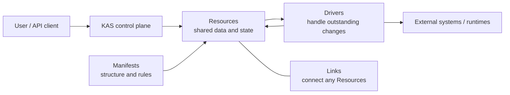
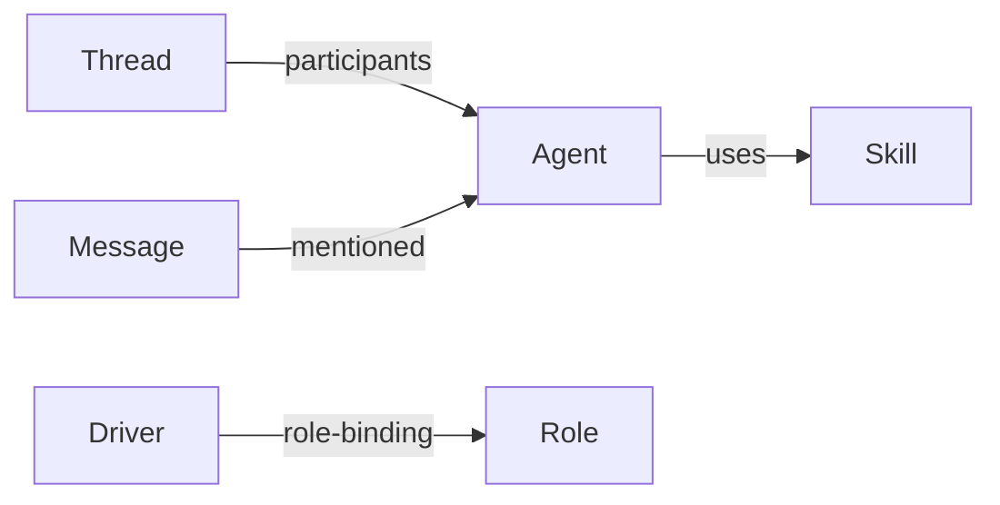
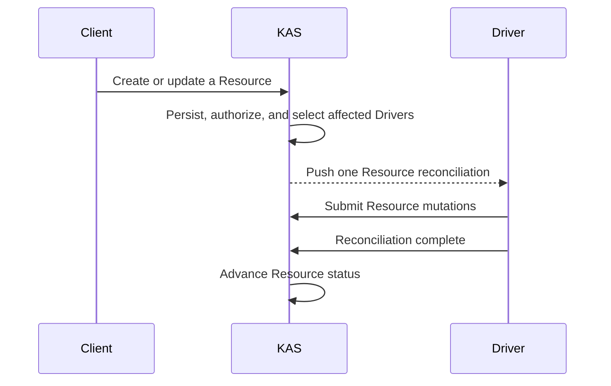

# KAS

English | [简体中文](README.zh-CN.md)

> One Resource model for domain objects, relationships, authorization, and
> background coordination.

KAS is a Resource-oriented application control plane. You describe what should
exist; KAS stores those objects, enforces permissions, records relationships,
and sends each relevant change to the Driver responsible for handling it.

It is a foundation for Agent platforms, automation control planes, integration
hubs, and other systems where multiple background capabilities collaborate
around shared objects. The `core` branch contains the generic kernel. The
`master` branch also includes the ready-to-use
[KAS Platform](https://github.com/kdxcxs/kas/tree/master/platform).



## Why KAS

Many systems create separate models for tasks, users, permissions,
relationships, background jobs, and plugins, then add another synchronization
layer to keep them consistent. KAS represents all of them as Resources:

- every object has a stable path;
- a Manifest defines its structure and semantics;
- Links express explicit relationships;
- one RBAC model authorizes every object;
- Drivers continuously converge desired and current state.

Platform capabilities can therefore be installed and upgraded as Packages
instead of becoming new special cases in the kernel.

## The smallest useful mental model

### Resource

The only public persistent primitive in KAS. Agents, Messages, Roles, Drivers,
and even Manifests are all Resources. Every Resource has a stable `path`,
desired data, and current status:

```json
{
  "path": "/agents/planner",
  "metadata": {
    "manifest": "/manifests/agent",
    "state": "available"
  },
  "spec": {
    "model": "gpt-5"
  },
  "status": {
    "metadata": {
      "state": "available"
    },
    "spec": {
      "model": "gpt-5"
    }
  }
}
```

### Manifest

A Manifest defines the schema, states, and available capabilities of a class of
Resources. It is itself a Resource, so new domain types can be installed
dynamically without changing the KAS kernel.

### Driver

A Driver makes a Resource's current state converge on its desired state. One
Driver may manage several Manifests or watch additional Resources, while KAS
delivers only changes that require work. All Resources of a Manifest share a
singleton Driver process; KAS does not start one process per instance.

### Relation and Link

A Relation defines which relationships are valid. A Link is one concrete
relationship and may connect any two Resources:



### Action and Run

An Action describes an operation available for a Resource. A Run records one
execution of that Action. Both are Resources, so execution history uses the
same querying, authorization, and relationship model.

### Package

A Package is the KAS delivery unit. It can install a Manifest, initial
Resources, and a Driver together, allowing a feature to bring its own data
definition, relationships, permissions, and runtime behavior.

## How KAS works



KAS Core implements this generic control loop without embedding product
domains. KAS Platform supplies Agents, Threads, Messages, Files, Skills,
Approvals, and a pluggable frontend as ordinary Packages.

## Core and Platform

| Project | Responsibility |
| --- | --- |
| **KAS Core** | Resource API, Manifests, Packages, RBAC, Links, Driver runtime, and SQLite/PostgreSQL storage |
| **KAS Platform** | A batteries-included multi-Agent collaboration product and Web UI built on Core |

Core lives in the root `crates/`, `apps/`, and `builtins/` directories.
Product-specific Packages, Drivers, UI, deployment, and tests stay under
`platform/`, allowing Core to merge into the complete Platform without
entangling generic and product code.

## Learn more

- [Documentation index](docs/README.md)
- [Core technical reference](docs/technical-reference.md)
- [KAS Platform](https://github.com/kdxcxs/kas/tree/master/platform)
