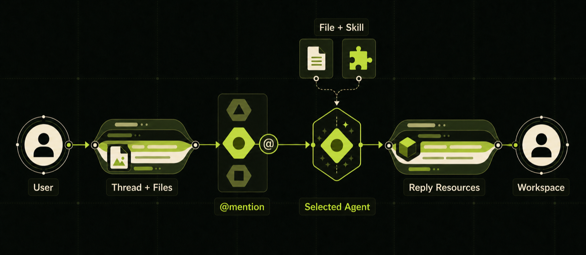
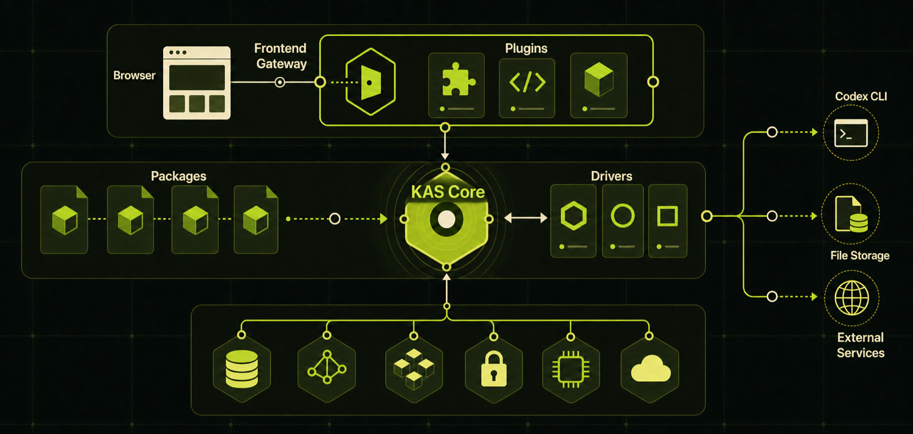

# KAS Platform

English | [简体中文](README.zh-CN.md)

> A Resource-native workspace where people and AI Agents work together.

KAS Platform is a batteries-included product built on
[KAS Core](../README.md). It models Threads, Agents, Messages, Files, Skills,
and Approvals as Resources, giving users one Workspace in which to organize
work, invite Agents, and understand the context, permissions, and results
behind every Agent action.

Agents run through the real Codex CLI. They retain persistent Sessions, read
new Thread messages and attachments, load assigned Skills, and publish replies
and work products through the KAS API.


## Quick start

Install Rust, Node.js, `curl`, `jq`, Python 3, and an authenticated Codex CLI,
then run this command from the repository root:

```bash
./platform/scripts/preview.sh
```

The script builds Core and the Platform packages, creates an isolated temporary
database, installs the frontend plugins, and prints the login token and service
URLs. Open `http://127.0.0.1:5173/` and use the printed token. Press
<kbd>Ctrl</kbd>+<kbd>C</kbd> to stop the preview and remove its temporary data.

For a persistent Docker deployment and configuration options, see the
[Platform technical reference](docs/technical-reference.md).

## What you can do

| Capability | What it provides |
| --- | --- |
| **Threads** | Organize participants, messages, files, and Agent Sessions around one collaboration |
| **Agents** | Run work through the real Codex CLI and trigger exactly the Agents named with `@handle` |
| **Sessions** | Preserve context for each Thread–Agent pair while isolating different Agents |
| **Files** | Upload arbitrary attachments with KAS-authorized upload, preview, and download |
| **Skills** | Version multi-file Skill bundles and assign them to one or more Agents |
| **Approvals** | Let a low-privilege Agent request one user-authorized operation without gaining standing access |
| **Frontend plugins** | Install management pages in the Workspace sidebar without rebuilding the host UI |

## A typical collaboration



> **One turn:** A user creates a Thread with Agents and Files, then sends an
> `@mention`. Only the selected Agent receives work, loads the Thread,
> attachments, and assigned Skills, and publishes its reply as new Resources
> in the same Thread.

Platform does not hide collaboration data in a separate chat database. The
Threads, Messages, Agents, attachment relationships, Approval records, and
plugin registrations visible in the UI are all queryable and authorizable
through the generic KAS Resource and Link model.

## Product structure



> **Product layers:** The Browser connects through the Frontend Gateway and
> plugin host to KAS Core. Packages install Resources into Core; singleton
> Drivers connect Core bidirectionally to Codex, File storage, and external
> services.

KAS Core supplies the stable Resource control plane. Platform features are
delivered as independent Packages. A Package may contain a Manifest, initial
Resources, and a Driver, so adding a product capability does not require a new
object type in Core.

The Web UI consists of a small Workspace host and installable iframe plugins.
The host owns login, navigation, and a controlled API bridge. Threads, Agents,
Skills, Approvals, and the generic object registry can evolve as independent
frontend plugins.

## Design principles

- **Resource is the common language.** Domain objects, permissions, and plugin
  registration all use the same model.
- **Agents work only when mentioned.** A Thread may contain several Agents,
  while Message Links select the participants for one turn.
- **Permissions stay minimal.** Each Agent uses its own Service Account. A
  privileged one-off operation requires an auditable Approval.
- **Content stays outside the control plane.** The File Driver stores and
  transfers large bytes; KAS stores descriptors and relationships.
- **Capabilities are installable.** Drivers, Skills, and frontend plugins can
  evolve without embedding product behavior in the kernel.

## Relationship to KAS Core

The `core` branch contains only the generic control plane. The `master` branch
adds `platform/` on top. Product-specific Packages, Drivers, UI, deployment,
and tests remain in this directory, preserving a one-way dependency that lets
Core merge into the complete product without conflicts.

## Learn more

- [Platform documentation](docs/README.md)
- [Platform technical reference](docs/technical-reference.md)
- [KAS Core overview](../README.md)
- [KAS Core documentation](../docs/README.md)
