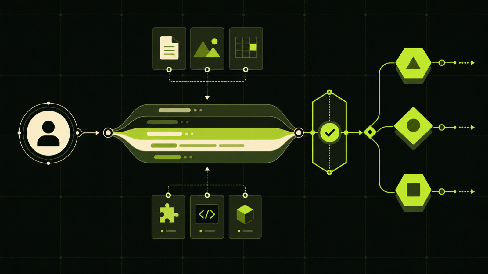
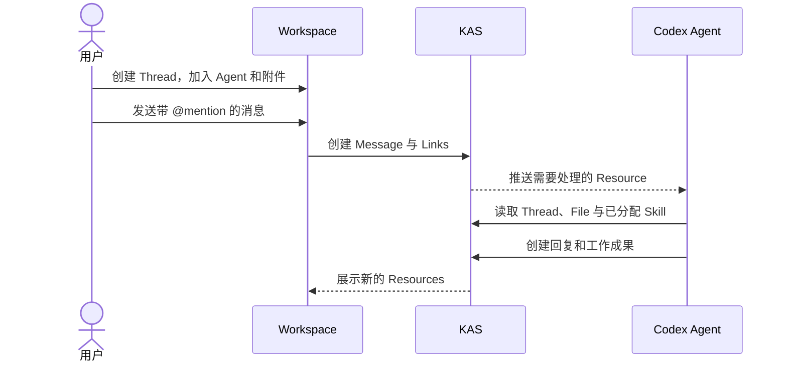
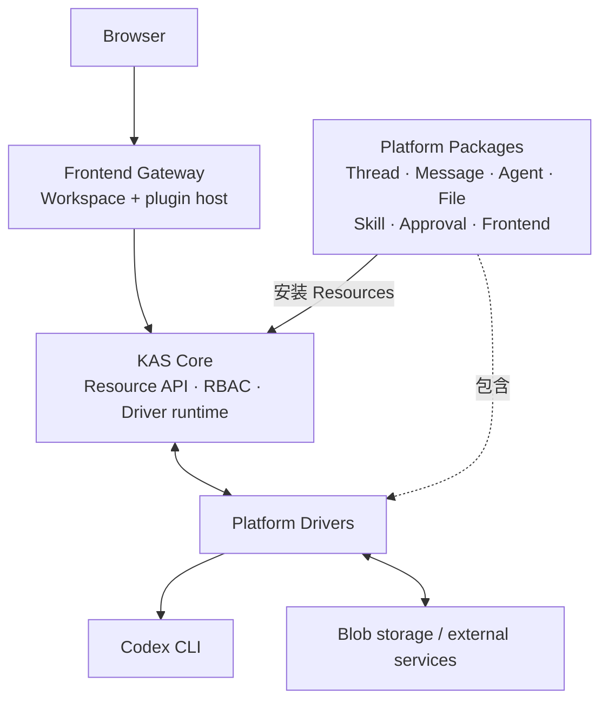

# KAS Platform

[English](README.md) | 简体中文

> 一个由人和 AI Agent 共同工作的 Resource 原生协作空间。

KAS Platform 是构建在 [KAS Core](../README.zh-CN.md) 之上的开箱即用产品。它把
Thread、Agent、Message、File、Skill 和 Approval 都建模为 Resource，让用户
可以在同一个 Workspace 中组织工作、邀请 Agent，并清楚地看到 Agent 使用了
什么上下文、获得了什么权限、产生了什么结果。

Agent 由真实的 Codex CLI 驱动。它们拥有持久 Session，可以读取 Thread
中的新消息和附件，按需加载 Skill，并通过 KAS API 将回复和工作结果写回平台。

## 在这里可以做什么

| 能力 | 它解决的问题 |
| --- | --- |
| **Threads** | 把一次协作的参与者、消息、文件和 Agent Session 组织在一起 |
| **Agents** | 使用真实 Codex CLI 执行工作，并通过 `@handle` 精确触发 |
| **Sessions** | 为每个 Thread–Agent 组合保留连续上下文，同时隔离不同 Agent |
| **Files** | 上传任意附件，并以 KAS 权限控制上传、预览和下载 |
| **Skills** | 把多文件 Skill bundle 作为可版本化能力分配给一个或多个 Agent |
| **Approvals** | 让低权限 Agent 为一次确定操作申请用户授权，而不扩大长期权限 |
| **Frontend plugins** | 把新的管理页面安装到 Workspace 侧边栏，而不重建宿主 UI |

## 一次典型协作

Platform 不依赖一套隐藏的聊天数据库。界面里看到的 Thread、Message、Agent、
附件关系、审批记录和插件注册信息，都可以通过 KAS 的通用 Resource 与 Link
模型查询和授权。

## 产品结构

KAS Core 提供稳定的 Resource 控制面；Platform 的产品功能则以相互独立的
Package 交付。每个 Package 可以包含 Manifest、初始化 Resources 和 Driver，
因此新增功能不需要在 Core 中增加新的对象类型。

Web 界面由一个很小的 Workspace 宿主和可安装的 iframe 插件组成。宿主负责
登录、导航和受控 API bridge；Threads、Agents、Skills、Approvals 和通用对象
管理页都可以作为前端插件独立演进。

## 核心设计原则

- **Resource 是共同语言**：产品中的领域对象、权限和插件注册都使用同一模型。
- **Agent 只在被提及时工作**：Thread 可以容纳多个 Agent，消息通过 Link
  明确选择本次参与者。
- **权限默认最小化**：Agent 使用自己的 Service Account；临时高权限操作必须
  经过可审计的 Approval。
- **内容与控制面分离**：大文件由 File Driver 保存和传输，KAS 只维护描述符
  与关系。
- **能力可以安装**：后台 Driver、Skill 和前端插件都能独立更新，不把业务
  逻辑写死在平台内核中。

## 与 KAS Core 的关系

仓库的 `core` 分支只维护通用控制面；`master` 分支在此基础上增加
`platform/`。Platform 只依赖 Core，Platform 专属 Package、Driver、UI、部署
和测试均留在本目录中，确保 Core 可以持续无冲突地合并进完整产品。

## 继续阅读

- [Platform 文档索引](docs/README.zh-CN.md)
- [Platform 技术参考](docs/technical-reference.md)
- [KAS Core 项目介绍](../README.zh-CN.md)
- [KAS Core 技术文档](../docs/README.zh-CN.md)
